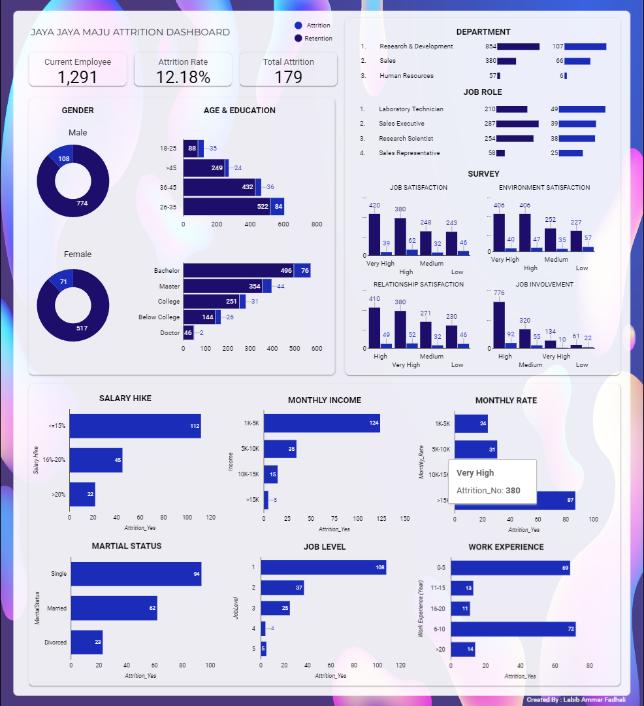

## Submission 1: Menyelesaikan Permasalahan Human Resources

## Business Understanding

Jaya Jaya Maju merupakan perusahaan multinasional yang berdiri sejak tahun 2000 dan memiliki lebih dari 1000 karyawan di seluruh negeri. Meskipun telah menjadi perusahaan besar, Jaya Jaya Maju menghadapi tantangan dalam mengelola karyawan, yang tercermin dari tingginya tingkat attrition hingga lebih dari 10%.

### Permasalahan Bisnis

Tingginya tingkat attrition berdampak negatif pada stabilitas perusahaan dan biaya yang dikeluarkan untuk merekrut dan melatih karyawan baru. Perusahaan ingin mengidentifikasi faktor-faktor apa yang mempengaruhi tingginya tingkat attrition ini.

### Cakupan Proyek

Proyek ini akan memfokuskan pada analisis data untuk mengidentifikasi faktor-faktor yang berkontribusi terhadap tingginya tingkat attrition. Selain itu, proyek ini akan mencakup pembuatan business dashboard untuk memonitor dan mengelola faktor-faktor tersebut dan pembuatan model machine learning untuk memprediksi potensi attrition karyawan di masa yang akan datang.

### Persiapan

Sumber data: https://github.com/dicodingacademy/dicoding_dataset/blob/main/employee/employee_data.csv

Setup environment:
- Install library yang dipakai
```
pip install -r requirements. txt
```
- Buka prediction.py dan tulis nama file yang akan diprediksi
```
data_to_predict = pd.read_csv('YOUR FILE') 
```
- Jalankan prediction.py
```
python prediction.py
```
## Business Dashboard

Business dashboard telah dibuat untuk memonitor faktor-faktor yang mempengaruhi tingkat attrition karyawan. Dashboard dapat diakses melalui [tautan ini](https://lookerstudio.google.com/reporting/3790bfe2-985f-4f19-8c64-b83a1f6e52fe).



## Conclusion

Berdasarkan analisis data, beberapa faktor yang berpotensi mempengaruhi tingkat attrition karyawan adalah :
- Tingkat Kepuasan dan Keterlibatan dalam pekerjaan yang rendah.
- Pendapatan bulanan dan kenaikan gaji yang rendah serta Monthly Rate yang tinggi.

### Rekomendasi Action Items

- Implementasikan program pelatihan dan pengembangan yang berkelanjutan untuk meningkatkan keterampilan dan keterlibatan karyawan.
- Berikan kesempatan untuk pertumbuhan karir yang jelas dan jalur promosi yang terdefinisi dengan baik.
- Evaluasi sistem kompensasi perusahaan untuk memastikan bahwa tingkat pendapatan dan kenaikan gaji sesuai dengan standar industri dan memadai untuk memenuhi kebutuhan karyawan dan menyediakan insentif atau bonus yang menarik untuk mendorong karyawan yang berkinerja tinggi dan memotivasi karyawan untuk tetap bertahan.
- Tingkatkan komunikasi antara manajemen dan karyawan untuk memahami kebutuhan dan harapan mereka dengan lebih baik.